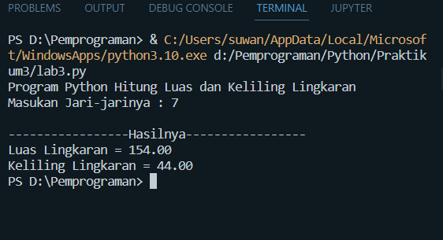

# Praktikum3
<h2>  <b>Program Python Menghitung Luas & Keliling Lingkaran</b>  </h2>

**DAFTAR ISI**
> - [Rumus Luas & Keliling Lingkaran](#rumus-luas--keliling-lingkaran)
> - [Flowchart Menghitung Luas & Keliling Lingkaran](#flowchart-menghitung-luas--keliling-lingkaran)
> - [Penginputan](#penginputan)
> - [Hasil](#hasil)
> - [PENJELASAN](#penjelasan)

### Rumus Luas & Keliling Lingkaran
Luas     = π × r²   Keliling = 2 x π × r

Nilai Phi yang akan kita gunakan adalah 22/7   r merupakan jari-jari lingkaran

Phi merupakan nilai konstanta di matematika sementara jari-jari merupakan jarak antara titik pusat dengan tepi lingkaran. Sebetulnya ada rumus lain untuk menghitung keliling lingkaran yaitu dengan menggunakan diameter, tapi pada kasus ini kita cukup menggunakan jari jari lingkaran saja.

### Flowchart Menghitung Luas & Keliling Lingkaran

### Penginputan 

### Hasil

### PENJELASAN

*   Kita deklarasikan variabel pi = 22/7, secara otomatis menggunakan tipe data float karena bernilai desimal.
*   Kemudian diminta memasukan nilai Jari-jari (r), inputan dibungkus      float agar nanti perhitungan dapat mengoprasikan nilai desimal.
*   Mengimplementasikan Rumus Luas dan Keliling yang sudah saya berikan    kedalam sebuah codingan.
*   Cetak memakai "{:.2f}".format(luas) penambahan "{:.2f}".format(), membatasi 2 karakter dibelakang koma.

